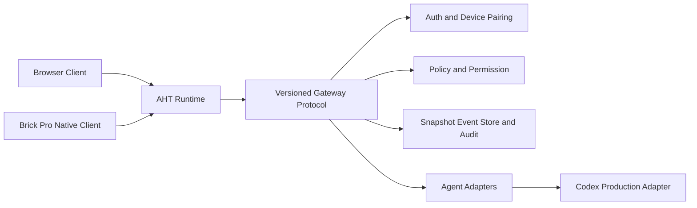

# AHT 产品设计规划

状态：已按推荐方案确认，作为下一阶段产品与工程执行基线；P0 基线与公开协议 reference 闭环已完成，P1 可信连接基础正在执行（reference 级配对会话签发/吊销、UI 会话可信展示、只读页面来源一致性已收口）
日期：2026-08-18

设计稿归档：[docs/design/README.md](../../design/README.md)

## 1. 产品结论

AHT（AI Handheld Terminal）第一阶段不是通用聊天设备，也不是远程 Shell。它是一台面向开发者和技术运营者的个人 AI 运维与审批终端：当远程 Agent 停在“需要你”状态时，用户可以在离开电脑后看见真实状态、理解风险、做出决定，并收到 Gateway 对结果的最终确认。

第一生产目标固定为：

> **以 Codex 为第一个真实 Agent，完成“Agent 需要人工决策 → AHT 展示 → 用户审批 → Gateway 事件确认 → 可审计”的闭环。**

当前已有的浏览器模拟器、V0.2 reference Gateway 和 Brick Pro 原生 bring-up 都服务于这条主线；它们不是三个独立产品。

## 2. 当前进展基线

### 2.1 已完成并有证据的能力

| 能力 | 当前状态 | 证据边界 |
| --- | --- | --- |
| 中文 4:3 浏览器模拟器 | 已实现 | 固定逻辑屏幕 `1024 × 768`；V0.1 浏览器验收通过 |
| Home / Needs You / Agents / Servers / Terminal | 已实现 | 页面、导航和本地交互可回归 |
| FixtureProvider | 已实现 | 无网络、可重复的开发数据源 |
| V0.2 GatewayProvider | 已实现 | 本地 WebSocket reference harness 支持 snapshot、event、ack、断线、resume 和 source 切换 |
| Gateway approval UI 闭环 | 已实现并验证 | 本地 reference Gateway 下，A/X 命令可读回事件确认 |
| `aht.gateway.v1` 公开协议业务闭环 | 已实现并验证 | 严格 parser、授权/session/scope、snapshot/event revision、command precondition、ack/final event、幂等、resync、audit 和 reference WebSocket 回归 |
| Reference Gateway 可恢复状态 | 已实现（reference 级） | 可选 JSON store 恢复 snapshot、event history、command ledger 和 audit；损坏 store fail closed，不等于生产持久化 |
| 配对会话签发/吊销 | 已实现（reference 级） | `pairing_confirm` 签发每设备 `paired:*` credential；`paired_session` hello 带 `expires_at`；`session_revoke` 吊销后同一 credential 返回 `credential_revoked`；设备注册与吊销集合随 JSON store 重启留存 |
| 会话上下文可信展示 | 已实现 | 页脚会话栏显示会话 ID、租户、主体、设备、权限 scope、过期时间与快照 event/revision/新鲜度；未授权、需要配对或上下文不完整时 fail closed，不充当成功会话 |
| 只读页面来源一致性 | 已实现 | Agents / Servers / Needs You 统一显示 Fixture 或 Gateway authority 来源、快照版本与新鲜度；Gateway 模式下不再硬编码 FIXTURE/本地模拟 |
| Brick Pro 原生 ARM64 层 | 已实现并有真机记录 | framebuffer、evdev、中文渲染、MainUI app 包和按键流程已有验证记录 |
| LobeHub Grok MainUI 桌面图标 | 已实现，真机回读完成 | 官方 `@lobehub/icons` import + 离线栅格化；`npm run device:push` 推送后 SHA-256 一致，重启 MainUI 后 framebuffer 回读新版 glyph-dominant 图标（见 [AHT Brick Pro 原生小程序验证记录](../verification/aht-native-brickpro.md)） |
| Browser / Native 主体状态模型 | 已部分对齐 | 通过各自的 TypeScript/C++ 模型维护，尚未由单一 schema 生成 |

### 2.2 尚未交付的产品能力

| 能力 | 状态 | 产品影响 |
| --- | --- | --- |
| 生产 Gateway | 未交付 | 当前 reference harness 不能代表生产权威 |
| 认证、设备配对、租户和权限 | reference 级已实现，生产未交付 | 本地 harness 已可配对签发/吊销 reference 会话；真实 Auth/Pairing、租户隔离和长期凭据仍由生产服务提供 |
| 生产持久化 snapshot、event store、审计 | 未交付 | 当前只有 reference 级本地 JSON store，尚无生产数据库、跨进程一致性和留存策略 |
| Codex 生产 Adapter | 未交付 | 目前只有本地协议参考闭环 |
| 真实 Agent 会话控制 | 未交付 | Agents 页先保持只读 |
| 真实 SSH/Mosh/Terminal | 未交付 | 当前 Terminal 只能是本地只读回显 |
| 真实麦克风和 Voice STT | 未交付 | Voice 只能是预览或隐藏能力 |

### 2.3 当前工作区状态

当前分支为 `feat/aht-v0.1-browser-simulator`，HEAD 为公开协议业务闭环提交 `9a76f18`。工作区包含原生实现、Grok 桌面图标、真机截图、验证文档以及 README/spec/plan 的未提交修改；共享任务仍在同一工作区协作。该状态说明原生 bring-up 和协议 reference 已有实质进展，但不应被描述成一个已经整理、提交、发布的生产产品版本。

当前重跑的本地检查结果：

- `npm test -- --run`：完整回归结果以当前工作区实际输出为准；本阶段新增 reference store 与重启恢复测试。
- `npm run build`：TypeScript 和 Vite 构建通过，模块数量以当前构建输出为准。
- `make -C native test host-smoke arm64 uinput-pad app-package`：原生 model、renderer、UI、host smoke、ARM64、uinput 和 app package 检查通过。
- 以上结果证明本地代码和打包链可运行，不证明生产 Gateway、真实 Agent Adapter 或未来发布流程已经完成。

## 3. 用户与核心任务

### 3.1 目标用户

- 运行 Codex、Claude Code、DeepSeek Harness 等远程 Agent 的个人开发者。
- 管理多个自动化任务或远程服务器的技术负责人。
- 需要在离开电脑后处理审批、异常和人工确认的技术运营者。

### 3.2 核心用户任务

当 Agent 停在“需要你”状态时，用户必须能够：

1. 看见是哪一个 Agent 在等待。
2. 知道它要求用户做什么，以及可能影响什么。
3. 判断风险、来源、权限和数据新鲜度。
4. 做出批准、拒绝或稍后处理决定。
5. 看到 Gateway 对命令接收和最终结果的区别。
6. 在断线、陈旧、权限不足或结果待确认时，不被误导成成功状态。

产品价值不是“让用户在设备上做更多操作”，而是“让用户在最少操作下做出可信的人机决策”。

## 4. 产品原则

### 4.1 决策优先，不是聊天优先

Home 的第一任务是显示需要用户处理的事项。聊天、长文本输入、模型切换和终端命令不进入第一阶段的主导航。

### 4.2 证据先于动作

每条远程事项都要显示 Agent、风险、来源、更新时间和当前权限。用户在缺少必要证据时只能查看、重试或稍后处理，不能被引导直接执行。

### 4.3 失败关闭

断线、陈旧、未知、权限不足和事件超时都必须显示为明确的非成功状态。任何 UI 点击都不能单独构成“已批准”或“已完成”。

### 4.4 设备状态和远程权威分离

电量、屏幕、输入和本地连接属于设备；Agent、Needs You、服务器和审批结果属于 Gateway。两类状态不能互相填充或用旧 fixture 静默补齐。

### 4.5 小屏优先、渐进披露

先给用户一个可扫描的决策摘要，再进入详情和操作。高风险事项需要足够上下文，不通过堆叠更多卡片解决信息不足。

### 4.6 预览必须诚实

Fixture、reference Gateway、Developer Preview 和本地回显都要在适当位置清晰标识。开发能力不能通过换一个标签变成生产能力。

## 5. 第一阶段产品边界

### 5.1 必须交付

- “现在需要你”作为首页第一入口。
- Needs You 列表和单项详情。
- Agent、风险、影响、来源和更新时间展示。
- Gateway 连接、数据新鲜度、陈旧原因和错误原因展示。
- Codex approval 的真实命令、命令回执和最终事件确认。
- Agents 只读状态概览。
- Servers 只读健康概览。
- 浏览器和 Brick Pro 原生客户端使用同一套协议语义。
- 每一次决策都有明确的 `command_id`、目标和最终状态。
- 断线或权限不足时没有隐式 fixture fallback。

### 5.2 第一阶段明确不做

- 通用聊天和长文本任务输入。
- 真实 SSH、Mosh 或 Shell 执行。
- 离线排队审批。
- 批量审批。
- 多 Agent 同时控制。
- 真实语音识别和语音指令。
- 固件刷写、自定义 CFW、eMMC 写入或系统目录修改。
- 在没有真实 Adapter、权限和审计的情况下开放 Agent 操作。

Terminal 可以保留为诊断入口，但必须标为“本地只读回显”；Voice 可以保留为开发预览，但不进入第一阶段产品承诺。

## 6. 信息架构与交互

### 6.1 一级结构

```text
Home
 └── Needs You / 待处理事项
      └── 详情与决策

Agents
 └── Agent 状态概览

Servers
 └── 服务器健康概览

Connection / Settings
 └── Gateway、设备、权限与数据新鲜度
```

Home 和 Needs You 是主产品；Agents 与 Servers 是辅助判断上下文。Terminal 不作为第一阶段的主价值入口。

### 6.2 主流程

```text
设备配对
  ↓
Gateway 连接
  ↓
Home 显示待处理事项
  ↓
打开一条 Needs You
  ↓
检查 Agent、风险、影响、来源、更新时间
  ↓
批准 / 拒绝 / 稍后
  ↓
command_ack
  ↓
Gateway event
  ↓
显示最终确认结果并写入审计
```

### 6.3 Home 设计要求

- 标题明确表达“现在需要你”，而不是泛化为“仪表盘”。
- 待处理数量和最老事项年龄必须可见。
- 列表默认按风险、等待时间和需要用户程度排序。
- 卡片显示 Agent、事项类型、简短影响、风险和更新时间。
- 数据源和新鲜度在全局状态栏可见，不依赖用户打开详情才发现陈旧。
- 空状态需要说明“当前没有需要你处理的事项”，不能显示空白页面。

### 6.4 详情与审批要求

详情页至少回答：

- 这是哪个 Agent 发起的请求？
- 它要求用户做什么？
- 影响范围是什么？
- 风险为什么是低、中或高？
- 数据来自哪里，更新时间是什么？
- 当前用户和设备是否有权执行？
- Gateway 是否在线且快照仍然新鲜？

操作状态必须区分：

```text
可操作 → 发送中 → Gateway 已接收 → 等待最终事件 → 已确认 / 失败 / 结果待确认
```

收到 `command_ack` 只能进入“Gateway 已接收”，不能直接显示最终批准。只有目标事件确认后才显示“已批准”或“已拒绝”。

当连接陈旧、断开、权限未知或快照不可验证时，所有需要远程写入的决策按钮默认禁用；页面提供重试、刷新或稍后处理路径，不提供离线写入队列。

## 7. 数据权威与系统架构

### 7.1 权威边界

设备本地负责：

- 电量、屏幕尺寸、刷新率、旋转、帧缓冲。
- 本地按键和输入可用性。
- 本地启动、退出和渲染。
- 与 Gateway 的传输连接状态。

Gateway 负责：

- Agent 状态、当前任务和会话摘要。
- Needs You 内容、风险、动作和状态。
- 服务器状态与网络快照。
- 用户、设备、租户和 Agent 权限。
- 审批命令、事件游标和审计记录。

### 7.2 目标架构



Browser 和 Native 是两个展示端，不应各自发展业务权威。`aht.gateway.v1` 需要从 reference harness 演进为有认证、权限、持久化和真实 Adapter 的生产协议。

### 7.3 快照最低字段

每份远程快照应携带：

```text
source
schema_version
revision
event_id
generated_at
received_at
freshness
stale_reason
permission_scope
```

`Fixture` 只允许出现在开发和回归环境。生产 UI 必须使用“实时、陈旧、不可用、权限不足、结果待确认”等真实状态，不使用 fixture 数据补齐缺失字段。

### 7.4 第一生产 Adapter

第一生产 Adapter 固定为 Codex：

- 现有 Codex approval 已经有最完整的 UI 和协议映射。
- 可以优先验证人机决策闭环，而不是同时解决多个 Agent 的协议差异。
- DeepSeek Harness、Claude Code、OpenClaw 等继续显示为 `developer_preview` 或 `planned`，不提前承诺真实控制。

## 8. 路线图与退出标准

### P0：产品收束与工程基线（已完成基线冻结，工作区整理未提交）

目标：把当前 demo、协议参考和真机 bring-up 正确归类。

交付：

- 冻结本文件的产品定位和第一阶段边界。
- 区分 Fixture、reference Gateway、生产 Gateway 三种状态。
- 整理原生未提交实现、截图和验证文档，但不删除用户已有文件。
- 统一 Browser / Native 的状态枚举、审批行为和错误语义。
- 将 Terminal、Voice 标记为诊断/预览能力。

退出标准：任何页面都不会把本地模拟、协议参考或真机 bring-up 描述成生产能力。

### P1：可信连接基础（执行中，当前完成 reference 可恢复状态）

目标：设备可以安全地看见真实状态。

交付：

- Gateway 认证和设备配对。
- 用户、设备、租户和 Agent scope。
- 持久化 snapshot / event store。
- 事件游标、断线恢复和数据新鲜度。
- 只读 Agents、Servers、Needs You。

当前证据：reference harness 已可选持久化 snapshot、event history、command ledger 和 audit 回读；
已收口配对会话签发/吊销（每设备 credential、TTL、吊销留存）；生产 Auth、租户隔离、生产 store 与真实 Gateway 仍未完成。
UI 已收口会话上下文可信展示：页面可准确显示会话来源、权限范围和过期时间，未授权/需要配对/上下文不完整时决策锁定。
只读页面（Agents / Servers / Needs You）已统一标注来源、快照版本与新鲜度，Gateway 模式下不会再出现 FIXTURE 硬编码。

退出标准：用户能连接真实 Gateway，并准确判断来源、更新时间和权限范围。

### P2：安全审批闭环

目标：完成第一条真实生产价值链。

交付：

- Codex production adapter。
- Gateway policy 检查。
- command 幂等、重试和目标校验。
- ack 与最终 event 分离。
- 审批审计记录。
- stale、disconnected、unauthorized 时阻止操作。
- Browser 与 Brick Pro 对同一事件读回一致。

退出标准：每次批准或拒绝都能证明由谁、通过哪台设备、针对哪条事项、在什么数据版本上做出，并得到最终事件确认。

### P3：手持客户端产品化

目标：Brick Pro 成为可持续使用的正式客户端。

交付：

- Native 与 Gateway 的正式 adapter。
- 配对、更新和故障恢复。
- 启动失败、输入不可用和断线提示。
- 与浏览器参考客户端一致的页面和协议语义。
- SD 应用包发布流程，不涉及固件刷写。

退出标准：真实设备可以完成连接、查看、审批、回读和退出，且没有隐藏 fixture fallback。

### P4：根据真实使用证据扩展

可选方向：

- 更多 Agent Adapter。
- 低风险 Agent stop / steer。
- 事件摘要和通知策略。
- 真实语音输入。
- 远程 Terminal。

只有在 P2 的真实审批闭环稳定后，才进入这些扩展；页面已经有占位不等于能力已经进入产品范围。

## 9. 产品与工程验收标准

### 产品验收

- 用户可以从 Home 找到待处理事项并打开详情。
- 用户在详情页能理解 Agent、动作、风险、影响、来源和更新时间。
- 断线、陈旧和权限不足状态始终可见。
- 任何最终成功状态都由 Gateway event 确认。
- 结果超时显示“结果待确认”，不显示成功。
- 用户有明确的返回、重试和稍后处理路径。
- Browser 与 Native 对同一事件显示一致的最终状态。

### 数据与安全验收

- 生产页面不使用 Fixture fallback。
- 每条命令包含幂等标识和明确目标。
- 未授权目标被 Gateway 拒绝。
- 审计记录包含用户、设备、Agent、事项、决策、命令和最终事件。
- stale、disconnected、unknown 和 unavailable 不被映射为 online 或 success。
- 设备本地状态不会替代 Gateway 远程权威。

### 体验指标

第一阶段以可信决策质量衡量，而不是页面数量：

- 事件确认率：所有审批结果都能关联到最终 Gateway event。
- 决策耗时：从用户看到事项到完成可信决策的时间。
- 陈旧操作拦截率：陈旧或断线时阻止所有不应执行的远程写入。
- 误导事件数：将模拟、陈旧、待确认或未授权状态显示为实时成功的次数，目标为零。
- 未处理事项：按风险和等待时间观察，而不是简单追求清空数量。

## 10. 需要保持公开的未决事项

这些事项不改变产品主线，但必须在 P1/P2 中明确：

1. Gateway 使用单用户、团队还是多租户权限模型。
2. Brick Pro 设备的首次配对方式和设备撤销方式。
3. Codex Adapter 的真实部署位置、身份验证方式和事件来源。
4. 高风险审批是否要求二次确认或策略批准。
5. 通知由 Gateway 推送、设备轮询还是外部消息渠道负责。
6. 审计数据保存周期和用户可见范围。

在这些决定确认前，不应开放真实生产审批，也不应把本地 reference Gateway 作为可部署服务。

## 11. 当前执行顺序

1. 保留并单独整理当前原生 bring-up、Grok 图标及验证证据，不将其与生产 Gateway 混合描述。
2. 冻结并继续回归生产 Gateway 的身份、权限、快照新鲜度和事件确认契约；公开协议 reference 闭环已经完成。
3. 先把 reference JSON store 的重启、审计回读和 fail-closed 证据固定，再替换为可审查的生产 store/auth 接口；不能把 reference 凭据或本地文件当成生产方案。
4. 先实现只读真实连接，再实现 Codex 单 Agent 审批；外部服务身份、真实事件来源和部署证据必须独立确认。
5. 在 Browser 端完成真实闭环回归后，再将同一协议接入 Native。
6. 通过真实使用证据决定是否进入更多 Agent、语音或 Terminal。

本规划不授权刷写固件、修改 eMMC、部署生产服务或接触未定义的客户数据和凭证。它只定义产品方向、系统边界和后续交付顺序。
