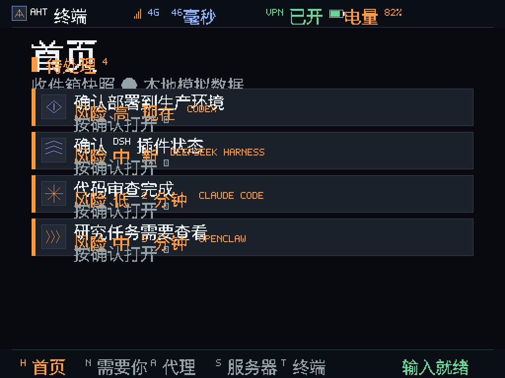
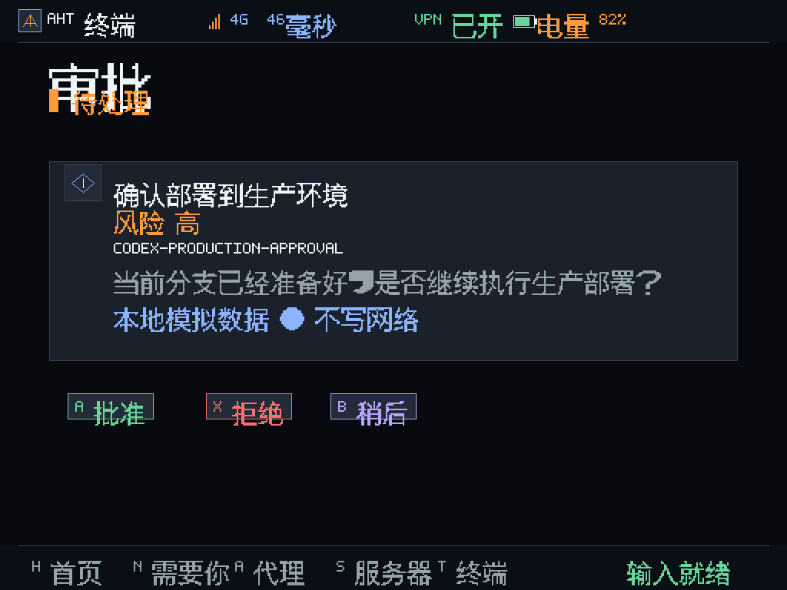
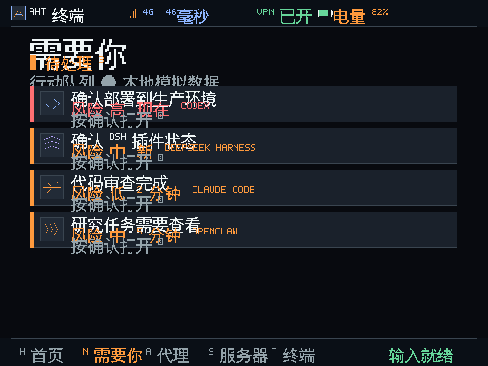

# AHT Brick Pro 原生小程序验证记录

日期：2026-08-18
范围：把当前 AHT fixture 状态模型和五个页面做成 Brick Pro 原厂 MainUI 桌面可直接打开执行的原生 ARM64 小程序。
结论：已安装到 `/mnt/SDCARD/Apps/AHT`，MainUI 识别并展示 LobeHub Grok 桌面图标；从 Apps 标签页按 A 可启动，A/X/B、十字键、START 退出流程在真机上验证通过。原生层已内嵌 180 个 CJK 字形，首页/需要你/审批等中文标题、状态枚举和 Agent 内容均在真机屏幕直接渲染，不再显示方框；同时加入 AHT LOGO、状态栏图标和 7 个 Agent 图标。只写 SD 卡用户应用目录，未刷固件、未写 eMMC 或系统目录。

## 真机环境

- ADB serial：`5c000c28344588823dd`
- 系统：TinaLinux `4.9.191` aarch64，root shell
- Framebuffer readback：`1024x768-60`，geometry `1024 768 1024 16384 32`，BGRA32、stride 4096
- 物理输入：`/dev/input/event3` = `TRIMUI Player1`（BTN_A/B/X/Y、ABS_HAT0X/Y、摇杆）
- 自动化测试输入：uinput 虚拟 `TRIMUI Player1`，设备节点 `/dev/input/event4`
- SD 卡：`/mnt/SDCARD`（exFAT），应用目录 `/mnt/SDCARD/Apps/AHT`

## 安装与 MainUI 识别

应用包由 `make -C native app-package` 生成，推送到：

```text
/mnt/SDCARD/Apps/AHT/config.json
/mnt/SDCARD/Apps/AHT/launch.sh
/mnt/SDCARD/Apps/AHT/icon.png
/mnt/SDCARD/Apps/AHT/aht-native-arm64
/mnt/SDCARD/Apps/AHT/README.txt
```

ARM64 二进制 SHA-256：

```text
1d182214257f8d5ade4c8141f2b9ceda58caf37febfd20407bc90bd72261d5b2
```

本次中文 + LOGO 版本包内文件：

```text
/mnt/SDCARD/Apps/AHT/config.json
/mnt/SDCARD/Apps/AHT/launch.sh
/mnt/SDCARD/Apps/AHT/icon.png        （LobeHub Grok 桌面图标）
/mnt/SDCARD/Apps/AHT/aht-native-arm64
/mnt/SDCARD/Apps/AHT/README.txt
```

桌面 App 图标 `icon.png` 由 `native/tools/make_icon.py` 从浏览器与设备共用的 `src/assets/agents/grok.svg` 生成（4x 超采样抗锯齿，纯标准库，无设备侧运行时依赖）：官方 LobeHub `Grok` 黑色 path 放在白色圆角磁贴中，未再叠加 AHT 自绘字母或自定义 LOGO。SHA-256：

```text
141884902a86f33edec2b6af918537fb2d54125fdd878f34b42e4e4863671acb
```

本次 Grok 图标修订的真机回读：本地 `native/dist-app/AHT/icon.png` 与设备 `/mnt/SDCARD/Apps/AHT/icon.png` SHA-256 均为上述值；重启 MainUI 后在 Apps `2/2` 页面选中 AHT，framebuffer 截图为 `/tmp/aht-grok-device.png`，显示官方黑色 Grok path、白色圆角磁贴和未遮挡的 `AHT 智能终端` 标签。

重启 MainUI 后日志确认应用被官方扫描器加载：

```text
MainUI: parse /mnt/SDCARD/Apps/AHT/config.json
MainUI: add AHT 智能终端 icon(/mnt/SDCARD/Apps/AHT/icon.png) posterpath(...) launch(/mnt/SDCARD/Apps/AHT/launch.sh)
MainUI: app 8, icon /mnt/SDCARD/Apps/AHT/icon.png, show 1
MainUI: AHT 智能终端 focusicon 300x300, nofocusicon 300x300
```

## 从桌面启动

`/tmp/state.json` 记录当前在 Apps 标签页（`tabidx=3`），选中项 `currpos=8`（AHT）。按 A 后 MainUI 写入官方启动通道并退出：

```text
MainUI: Add2RecentList AHT 智能终端
MainUI: a is 68, quit mainui
```

`/tmp/cmd_to_run.sh` 内容：

```sh
cd /mnt/SDCARD/Apps/AHT; chmod a+x ./launch.sh; ./launch.sh
```

`runtrimui.sh` 随即执行该脚本，AHT 进程接管 `/dev/fb0`；默认输入为物理手柄：

```text
/proc/<pid>/fd/3 -> /dev/fb0
/proc/<pid>/fd/4 -> /dev/input/event3
```

## 真机按键流程

使用 uinput 虚拟手柄（`AHT_INPUT_DEVICE=/dev/input/event4`）走完整流程，每一步都用 `fbscreencap` 截图并经 OCR 回读：

| 步骤 | 输入 | 屏幕回读 | 证据 |
| --- | --- | --- | --- |
| Home | 无 | 首页标题“首页”、LOGO、`PENDING 4`、Inbox 中文卡片 | [aht-brickpro-cn-home.png](screens/aht-brickpro-cn-home.png) |
| 打开审批 | A | “审批”、Agent 图标、`CODEX-PRODUCTION-APPROVAL`、风险高 | [aht-brickpro-cn-approval.png](screens/aht-brickpro-cn-approval.png) |
| 拒绝并返回 | X、B | “需要你”、`PENDING 3`、底部中文导航 | [aht-brickpro-cn-needs.png](screens/aht-brickpro-cn-needs.png) |
| 十字键选择第二条 | 下、A | `APPROVAL / CLAUDE-CODE-REVIEW` | [aht-brickpro-approval-2.png](screens/aht-brickpro-approval-2.png) |
| 退出回桌面 | START | AHT 退出，MainUI 自动重启 | 日志 `cmd_to_run.sh` 被删除 |

真实桌面默认启动（不设 `AHT_INPUT_DEVICE`）时，AHT 自动选择物理 `TRIMUI Player1`（event3），因此用户在掌机上直接用实体 A/X/B、十字键和 START 操作。

## 中文渲染与 LOGO/图标

中文不再依赖设备字体文件。`native/tools/make_cjk_font.py` 扫描渲染器和模型中的非 ASCII 字符，用本机 CJK 字体渲染 16×16 单色位图，生成内嵌字库 `native/include/aht/cjk_glyphs.hpp`（180 个字形，约 28KB）；Makefile 提供 `make -C native cjk-font` 重新生成。渲染器把 `drawText()` 改为 UTF-8 解码，CJK 字符用字形绘制、Latin 字符沿用 5×7 表，未收录字符画方框占位；`textWidth()` 按字形宽度计算，中文 badge 不再按字节数被压缩。

图标部分：

- 顶部状态栏：AHT LOGO（A 形几何线条）、信号格、VPN 中文标记、电池图标 + “电量 N%”。
- Inbox/Agent 卡片：`drawAgentIcon()` 按 agentId 绘制 7 个几何图标（codex 菱形码、deepseek 海浪、claude 星芒、gemini 菱形、hermes 羽翼、openclaw 爪痕、opencode 双标线），各配图标颜色。
- 审批页：Agent 图标 + 中文标题/风险/详情/互动徽章。
- MainUI 桌面 App 图标 `icon.png`：复用 `src/assets/agents/grok.svg` 的官方 `Grok` path，使用白色圆角磁贴适配 MainUI 深色桌面；`make -C native icon` 用 4x 超采样离线重绘，网页端和设备端不再维护两套标志。

真机截图（framebuffer 直接回读）：





注：16×16 单色字形是嵌入式 bitmap，不是抗锯齿字体；人眼和像素截图可读出，OCR 识别不稳定属预期。

## 输入映射

- 十字键/左摇杆：列表上下选择
- A：打开条目 / 审批页批准
- X：审批页拒绝
- B：返回
- Y：Agents
- SELECT：Home
- START：退出并返回 MainUI

## 主机回归

主机测试仍然通过：

```text
make -C native test host-smoke
native model tests passed
native renderer tests passed
native ui tests passed
AHT native fixture
screen=home pending=4
screen=home pending=3 decision=已拒绝
```

原有 Vitest 套件保持通过（13 个测试文件、21 个测试）。原生层是新增目录，不替换 TypeScript `FixtureProvider` 或 V0.2 Gateway provider。

`make -C native test host-smoke arm64 uinput-pad app-package` 全绿；`npm test -- --run` 13 个文件 / 21 个测试全绿。渲染器测试新增：字库非空、关键中文全覆盖、中文像素绘制、LOGO 像素和 Agent 图标像素断言。

## 边界

- 只写 `/mnt/SDCARD/Apps/AHT` 用户应用目录，未修改 `/etc`、固件分区、`/mnt/UDISK` 系统文件。
- 未 kill `trimui_osdd`、`trimui_scened` 等系统服务；MainUI 的退出/重启是官方 `runtrimui.sh` 应用启动通道的一部分。
- 应用只渲染当前 fixture 状态，Gateway、SSH/Mosh、4G、麦克风和生产 Agent 连接均明确不可用。
- 主机交叉编译成功不等于设备启动；本记录中的设备证据来自真实 ADB 连接、MainUI 日志、进程 fd 回读和 framebuffer 截图 OCR。
